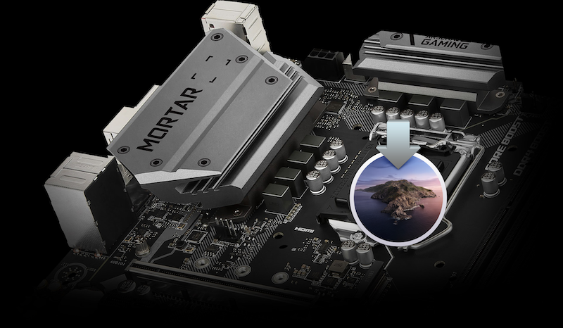

# MSI B360M Hackintosh Build & Changelog

with macOS Catalina 10.15.5 (19F101) inside

An EFI configuration file is usually not enough to make things clear, so I created a Wiki to elaborate on the problems I encountered while building Hackintosh and some of their solutions. Please read [this Wiki](https://github.com/derbalkon/B360M-CoffeeLake-Hackintosh/wiki/Special-Notes) over before using.

> **Please Note**: Hackintosh building is a process that requires proper debugging skills, sometimes depending on specific hardware with a little bit of luck. Decent OS running experience can only be guaranteed with specifications very much the same as mine if you decide to use this configuration. Do not take it as a textbook standard.

## Limitations

This configuration may only suitable for those who have **both** iGPU (computing only) and dGPU. If you are using specs that have only iGPU or only dGPU, I suggest not using this configuration because you may want to change model from iMac19,1 to other models. Otherwise you would experience blackscreen or magenta screen or some other undefined problems.

## Hardware List

|         Specs | Details                                            |
| ------------: | :------------------------------------------------- |
|         Board | MSI® B360M MORTAR™                                 |
|           CPU | Intel® Core™ i5-9400 (with Intel UHD Graphics 630) |
|        Memory | Corsair Vengeance® LPX 2 x 8GB (DDR4 2666MHz)      |
|           SSD | Intel® SSD 760p Series M.2 512GB                   |
|           HDD | Western Digital® 3.5″ Blue 1TB (WD10EZRZ)          |
|  Graphic Card | Sapphire® Radeon™ RX590 8GB (D5 NITRO+ SE FO)      |
| Wireless Card | Broadcom® BCM94360CD (bundled with Bluetooth 4.0)  |
|      Keyboard | IKBC® C87                                          |
|         Mouse | Logitech® MX Master 2S                             |
|       Monitor | Acer® Nitro XV272UP Widescreen LCD Monitor         |

## Changelog

### 06/04/2020

Initiate repository.

## Credit

- **Acidanthera's** [OpenCore Respository](https://github.com/acidanthera/OpenCorePkg)
- **Sukka's** [OpenCore Document zh_Hans](https://oc.skk.moe)
- **Installation Guide** from [Dortania](https://dortania.github.io/OpenCore-Desktop-Guide/), [DalianSky](https://blog.daliansky.net/OpenCore-BootLoader.html) and [XJN](https://blog.xjn819.com/?p=543)
