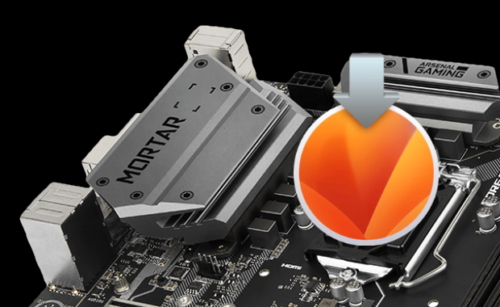

# MSI B360M Hackintosh Build & Changelog

[](https://github.com/acidanthera/OpenCorePkg/releases/latest)
[](https://www.apple.com/macos/monterey/)


> **Please Note**: This is only a personal build backup, not a textbook standard guide. If you are looking for a guide please go to **[this page](https://dortania.github.io/getting-started/)** for more informations.



## Limitation

This configuration may **ONLY** suitable for those who have **BOTH iGPU (computing only) AND dGPU**. If you are using specs that have only iGPU or dGPU, I suggest not using this configuration, or you may experience some other undefined behaviours.

This is a process that requires proper debugging skills, sometimes depending on specific hardware with a little bit of luck. Decent OS running experience can only be guaranteed with specs very much the same as mine if you decide to use this configuration.

## Hardware List

|         Specs | Details                                            |
| ------------: | :------------------------------------------------- |
|         Board | MSI® B360M MORTAR™                                 |
|           CPU | Intel® Core™ i5-9400 (with Intel UHD Graphics 630) |
|        Memory | Corsair Vengeance® LPX 2 x 8GB (DDR4 2666MHz)      |
|           SSD | Intel® SSD 760p Series M.2 512GB                   |
|           HDD | Western Digital® 3.5″ Blue 1TB (WD10EZRZ)          |
|  Graphic Card | Sapphire® Radeon™ RX590 8GB (D5 NITRO+ SE FO)      |
| Wireless Card | Broadcom® BCM94360CD (with Bluetooth 4.0)          |
|      Keyboard | IKBC® C87                                          |
|         Mouse | Logitech® MX Master 2S                             |
|       Monitor | Acer® Nitro XV272UP Widescreen LCD Monitor         |

## Recommended BIOS Settings

<details><summary>SETTINGS</summary>

  - <details><summary>Advanced</summary>

      - PCI Subsystem Settings
        - Above 4G Memory / Crypto Currency Mining [**Enabled**]
      - Integrated Graphics Configuration
        - Initiate Graphic Adapter [**PEG**]
        - Integrated Graphics Share Memory [**64M**]
        - IGD Multi-Monitor [**Enabled**]
      - USB Configuration
        - XHCI Hand-off [**Enabled**]
        - Legacy USB Support [**Enabled**]
      - Power Management Setup
        - Erp Ready [**Enabled**]
      - Windows OS Configuration
        - Windows 10 WHQL Support [**Enabled**]
        - MSI Fast Boot [**Disabled**]
      - Wake Up Event Setup
        - Wake Up Event By [**BIOS**]
        - Resume by USB Device [**Enabled**]
    
    </details>

  - <details><summary>Boot</summary>

      - Boot Mode Select [**UEFI**]
    
    </details>
</details>

<details><summary>OC (Overclocking)</summary>

  - CPU Features
    - Intel Virtualization Tech [**Enabled**]
    - Intel VT-D Tech [**Disabled**]
    - CFG Lock [**Disabled**]

</details>

## Configuration Explain

Things may vary per device and you may want to customize it, which I will **mark with * at the beginning**. Let's take a look from the folder level:

<details><summary><strong>ACPI</strong></summary>

  - `SSDT-AWAC`: Re-enable the old RTC clock that is compatible with macOS.
  - `SSDT-EC-USBX`: Create fake EC device for desktop and fix USB power.
  - `SSDT-PLUG`: Allow the kernel's XCPM (XNU's CPU Power Management) to manage our CPU's power management. Auto detect.
  - `SSDT-PMCR`: Fix NVRAM support for 300 series motherboard.
  - `* SSDT-SBUS-MCHC`: Not necessary. Fix AppleSMBus support.

</details>

</details>

<details><summary><strong>Drivers</strong></summary>

  - `OpenRuntime.efi`: Work with `Booter` quirks in config.plist.
  - `HfsPlus.efi`: Support HFS+ File System which is used by Recovery and Time Machine.
  - `OpenCanopy.efi`: Bring GUI for OpenCore.

</details>

<details><summary><strong>Kexts</strong></summary>

  - `Lilu`: Other kexts depending on this one.
  - `VirtualSMC`: SMC emulator layer.
  - `SMCProcessor`: CPU sensor support.
  - `SMCSuperIO`: IO sensor support.
  - `WhateverGreen`: Various patches necessary for GPU.
  - `AppleALC`: Native macOS HD audio for not officially supported codecs.
  - `IntelMausi`: Intel Ethernet LAN driver for macOS.
  - `NVMeFix`: Fix random kernel panic after wake caused by NVMe device.
  - `AirportBrcmFixup`: Fix Wi-Fi lagging after wake.
  - `* USBPorts`: Custom USB ports mapping for iMac19,2. Ports mapping may vary per device. This kext can be used directly if your USB ports are same as mine:
    
      ```zsh
      1.  HS01 - Internal - BRCM20702 Hub
      2.  HS03 - Internal - USB Keyboard
      3.  HS04 - Internal - USB Mouse
      4.  HS05 - USB 3 - Back USB 3 (SS01)
      5.  HS07 - USB 2 - Back USB 2
      6.  HS08 - USB 2 - Back USB 2
      7.  HS09 - USB 3 - Front USB 3 (SS05)
      8.  HS10 - USB 3 - Front USB 3 (SS06)
      9.  SS01 - Type 3 - Back USB 3
      10. SS02 - TypeC+Sw - Back Type C
      11. SS05 - USB 3 - Front USB 3
      12. SS06 - USB 3 - Front USB 3
      ```

</details>
  
<details><summary><strong>Resources</strong></summary>

  - Here put OpenCanopy resources.

</details>

<details><summary><strong>Tools</strong></summary>

  - `* ResetSystem.efi`: I choose `Firmware` argument in config.plist to reboot into BIOS firmware settings when necessary. Change as you wish.

</details>

<details><summary><strong>config.plist</strong></summary>

  - `* DeviceProperties`: I put `layout-id`, `igfxfw` and `shikigva` arguments here. You can delete them from here and put into boot-args if you wish.  
    Here I choose `layout-id 92` to fix audio. Even if the `Address` is not the same with our spec, I find it working well with this layout.  
    I use `shikigva 80` to fix DRM, delete it if you are experiencing screen freezing issue.
    The `igfxfw` value here is used to load Apple GuC firmware, delete it if you are experiencing display issues.
  - `* Generic`: You should generate SMBIOS info by using [GenSMBIOS](https://github.com/corpnewt/GenSMBIOS) to fix iServices, and make sure it is "Invalid Serial" or "Purchase Date not Validated" (i.e., no conflict with real Macs) for your own good by checking [Apple Check Coverage page](https://checkcoverage.apple.com/).

</details>

## Known Issues

### "I have to press keys twice to wake up."

- It may related to HID Tickle mode. The simplest way is to try adding boot argument `darkwake=no` (or `=1`? `=2`?). BUT it might also cause monitor to wake up during darkwake, or simply cannot sleep itself. Use at your own risk.

  > The default value on macOS Catalina for `gDarkWakeFlags` is `0x00000003`, which equals to `3` (`kDarkWakeFlagHIDTickleNone`). So by default Darkwake should not post any HID Tickle's. This also reveals the secret why some users encounter issues with frozen peripheral device's on Hack's when Power Nap is enabled. To use Darkwake on Hack's require very well configured USB ports.
  >
  > — [holyfield](https://www.insanelymac.com/forum/topic/342002-darkwake-on-macos-catalina-boot-args-darkwake8-darkwake10-are-obsolete/)

- Or try adding `SSDT-USBW.aml` and `USBWakeFixup.kext`. You can find them in the `/Extras` folder.

### "DRM won't work after I update Safari 14."

- Yes, Safari 14 breaks DRM patch on both Catalina and Big Sur on `iMac19,1` SMBIOS w/ `shikigva=80`.
- I'm not sure if `iMacPro1,1` SMBIOS w/ `shikigva=128` will do any better.

### "Apple Music can't play or keeps skipping songs."

- This is also a DRM issue.
- Try disabling loseless option in Apple Music preference.
- If this doesn't help, try run `defaults write com.apple.AppleGVA gvaForceAMDKE -boolean yes` in terminal to forces AMD DRM decoder for streaming services.
- If this still doesn't help, try some other combinations described in Acidanthera's [WhateverGreen Chart](https://github.com/acidanthera/WhateverGreen/blob/master/Manual/FAQ.Chart.md#drm-compatibility-on-macos-11).

## Changelog

### 6/7/2022

- Updated OpenCore to v0.8.1
- Updated WhateverGreen, AppleALC, AirportBrcmFixup
- Switched `Reset NVRAM` and `Toggle SIP` to configurable boot entry protocol drivers according to the latest manual

<details><summary><strong>History changes</strong></summary>

  ### 4/21/2022

  - Updated OpenCore to v0.8.0
  - Updated AppleALC
  - Adapted new entries to the latest manual

  ### 3/10/2022

  - Updated OpenCore to v0.7.9
  - Updated Lilu, AppleALC and WhateverGreen
  - Adapted new entries to the latest manua

  ### 1/11/2022

  - Updated OpenCore to v0.7.7
  - Updated Lilu, AppleALC and WhateverGreen
  - Adapted new entries to the latest manual

  ### 12/22/2021

  - Updated OpenCore to v0.7.6
  - Updated Lilu and SMC kexts
  - Added new entries of configuration
  - Adjusted `UIScale` location

  ### 11/04/2021

  - Updated OpenCore to v0.7.5
  - Updated AppleALC and WhateverGreen
  - Added kext version information into config.plist

  ### 10/26/2021

  - Updated OpenCore to v0.7.4 to satisfy macOS Monterey
  - Updated AppleALC and WhateverGreen
  - Adjust config entries order according to the latest manual

  ### 09/08/2021

  - Updated OpenCore to v0.7.3
  - Updated kexts and resources
  - Change drivers config style according to the latest manual

  ### 08/14/2021

  - Updated OpenCore to v0.7.2
  - Updated kexts and resources

  ### 07/06/2021

  - Updated OpenCore to v0.7.1
  - Updated kexts and resources

  ### 06/08/2021

  - Updated OpenCore to v0.7.0
  - Updated kexts and resources

  ### 05/04/2021

  - Updated OpenCore to v0.6.9
  - Updated Lilu and her friends

  ### 05/01/2021

  - Updated OpenCore to v0.6.8
  - Updated kexts
  - Added mouse support by setting `PickerAttributes` to `19`

  ### 03/02/2021

  - Updated OpenCore to v0.6.7
  - Updated kexts
  - Replaced SSDTs to acidanthera version
  - Moved Apple quick charge properties from `USBPorts.kext` to `SSDT-EC-USBX.aml`
  - Readded `shikigva 80` to fix Apple TV DRM

  ### 02/17/2021

  - Fixed invalid maskbit in `PickerAttributes`
  - Disabled unnecessary `AllowRelocationBlock`

  ### 02/01/2021

  - Updated OpenCore to v0.6.6
  - Updated `Lilu` and her friends
  - Replaced `BootProtect` with `LauncherOption` and `LauncherPath`
  - Added new terms and set to default value
  - Removed `Bootstrap.efi`
  - Set `PickerAttributes` to `15` (just because I don't like cursor)
  - Updated some resources

  ### 01/06/2021

  - Updated OpenCore to v0.6.5
  - Updated `Lilu` and her friends
  - Set `PickerAttributes` to `25`
  - Set `PickerVariable` to `Modern`
  - Updated `EFI/OC/Resources/Image` to experience modern boot picker icon set (Big Sur style)
  - Deprecated `DeduplicateBootOrder` quirk

  ### 12/12/2020

  - Updated OpenCore to v0.6.4
  - Updated `Lilu` and her friends
  - Enabled `ResetLogoStatus` to fix potential logo missing problem when booting Windows
  - Deprecated `run-efi-updater` NVRAM variable (not working on Big Sur) and enabled `BlacklistAppleUpdate` quirk
  - Added `SystemAudioVolume` NVRAM variable to meet the latest `PlayChime` standard
  - Disabled `DeduplicateBootOrder` as is now deprecated

  ### 11/18/2020

  - Adjust `USBPorts.kext` to support Apple quick charge for Big Sur.
  - Drop WhateverGreen DRM patch for Big Sur.

  ### 11/03/2020

  - Updated OpenCore to v0.6.3
  - Updated `Lilu` and her friends

  ### 10/07/2020

  - Updated OpenCore to v0.6.2
  - Updated `Lilu` and her friends
  - Set new entries of OpenCore v0.6.2 config to failsafe as they are mainly relevant to legacy machines
  - Drop `SSDT-MEM2-DMAC.aml`, not necessary

  ### 09/17/2020

  - Added `bootstrap` for better booting experience
  - Merged USB quick charging into `USBPorts.kext`
  - Fixed USB mapping IOClass from `AppleUSBMergeNub` to `AppleUSBHostMergeProperties` to match Catalina standard
  - Disabled some debug terms as this is a `RELEASE` build
  - Disabled `SetupVirtualMap`, not needed for MSI B360M
  - Disabled Apple Secure Boot, yeah, changed my mind

  ### 09/07/2020

  - Updated OpenCore to v0.6.1
  - Updated `Lilu` and her friends
  - Set `DiscardHibernateMap` to `false` as I turned off hibernate on Windows
  - Added `Arch` and `MinKernel` settings to meet OpenCore's latest standard
  - Set `DisableLinkeditJettison` to `true` to let `Lilu` and others function in macOS Big Sur with best performance without `keepsyms=1` boot argument
  - Added **Medium Security** of Apple Secure Boot, which means `SecureBootModel` set to `Default`, `ApECID` set to `0` and `DmgLoading` set to `Signed`
  - Set `AdviseWindows` to `false` as EFI partition is first on the Windows drive
  - Deleted `ExFatDxe.efi`
  - *Note*: Hotkeys to launch picker now works fine as OpenCore now won't reset input protocols any more

  ### 08/04/2020

  - Updated OpenCore to v0.6.0
  - Optimized ACPI hotpatches: `SSDT-EC-USBX`, `SSDT-AWAC`, `SSDT-PLUG`, `SSDT-PMCR`
  - Added new ACPI hotpatches for final touch: `SSDT-MEM2-DMAC`, `SSDT-SBUS-MCHC`
  - Updated `Lilu` and her friends
  - Deleted `CPUFriend` as i5-9400 does not necessarily need this
  - Added `AirportBrcmFixup` to fix Wi-Fi lagging after sleeping
  - Added an icon for `ResetSystem.efi`
  - Changed some `<data>` fields in config to `<number>` and `<string>` to avoid being eaten by Xcode 11
  - Added `Firmware` mode to ResetSystem to reboot into BIOS settings
  - Moved `shikigva` and `igfxfw` from `boot-arg` into `DeviceProperties`

  ### 06/04/2020

  - Initiated repository

</details>

## Credit

- **Acidanthera**'s [OpenCore Respository](https://github.com/acidanthera/OpenCorePkg)
- **Sukka's** [OpenCore Document zh_Hans](https://oc.skk.moe)
- **Installation Guide** from [Dortania](https://dortania.github.io/OpenCore-Install-Guide/), [DalianSky](https://blog.daliansky.net/OpenCore-BootLoader.html) and [XJN](https://blog.xjn819.com/?p=543)
